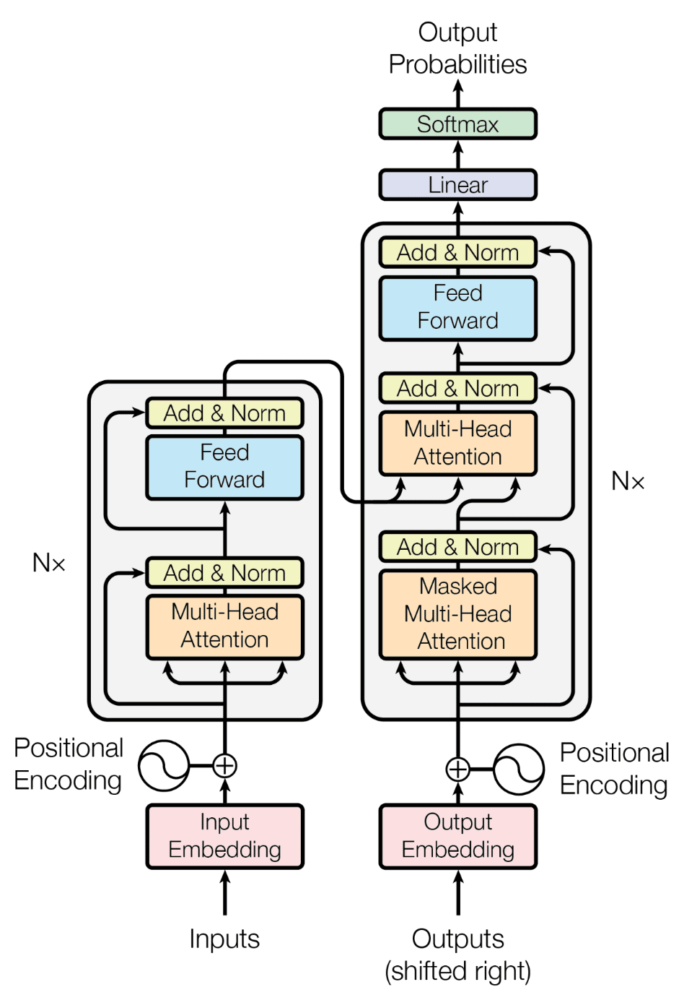

# Attention

**TLDR:** Attention provides a token-to-token relationship representation for a sequence that takes into account the contextual information of that token (i.e. how it is used in the sentence)
- It will find a *dot-product* value for each token and all other tokens in the sentence

### Attention Is All You Need - Vaswani et. al
- Paper that gave birth to the transformer
  - Why was the transformer a big deal?
    - Trained faster than previous architectures
    - Obtained higher evaluation results

### Example usage
```
Consider some function `f(...)` that calculates the embedding value.

Traditional embedding: "I ate an apple"
  - "I" --> f("I")=0.1
  - "ate" --> f("ate")=0.2
  - "an" --> f("an")=0.3
  - "apple" --> f("apple")=0.4

Transformer Embedding: "I at an apple"
  - "I" --> f("I") * f("I") + f("I") * f("ate") ....
  - "ate" --> f("ate") * f("I") + f("ate") * f("ate") ....
  - "an" --> f("an") * f("I") + f("an") * f("ate") ....
  - "apple" --> f("apple") * f("I") + f("apple") * f("ate") ....
```

# Transformer Architecture

Composed of an encoder and decoder stack that performs sequence-to-sequence translation.



## Encoder Stack

### 1. Input Embedding

- A skip-gram model like Word2Vec is used to convert the textual input to a numeric sequence.
- This does not have an contextual info, just numeric representation of the word

### 2. Positional Embedding

- Addition of positional information to the inputs
- This is just information about where in the sentence each token is

### 3. Multi-Headed Attention

- Encode contextual information of the sequence

### 4. Add and Normalize

- Take the original Positional + Embedded input and add it to the concatenated output of the multi-headed attention

### 5. Feed Forward Neural Network

- Run the outputs of the previous layers through a miniature neural network

### 6. Add and Normalize

- Take the original Positional + Embedded input and add it to the normalized output of the feed forward neural network

## Decoder Stack

### During Training

#### 1.A. Encode desired outputs

- Add positional information to the embedded desired output sequence

#### 1.B Apply Masked Multi-Headed Attention

- Idea is to only compute attention on the first part of the sequence in order to force the system to learn the relationship between the input sequence and the desired output.

### During Inference

#### 2.A. Encode Existing Output

- Transformers generate token-by-token output, so here we just pass in what sequence has been generated so far.

#### 2.B. Apply Multi-Headed Attention

- Effectively the same as the encoder stack


### C. Concatenation and Normalize

- Normalization of the concatenated output from the Multi-headed attention

### D. Multi-Headed Attention

- Output from the rest of the decoder stack and the encoder stack are taken in, and attention is applied

### E. Addition and Normalization

### F. Feed Forward Neural Network

### G. Addition and Normalization

### H. Linear Transformation (ReLU)

### I. Softmax Probabilities

- This output size is the length of the target vocabulary
- Some smarter language models use partial words as a target vocabulary so it can use words it hasn't seen before or wasn't technically taught with the target vocabulary


